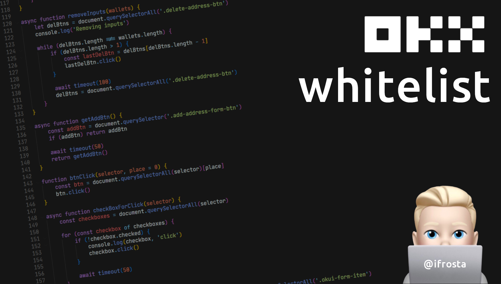
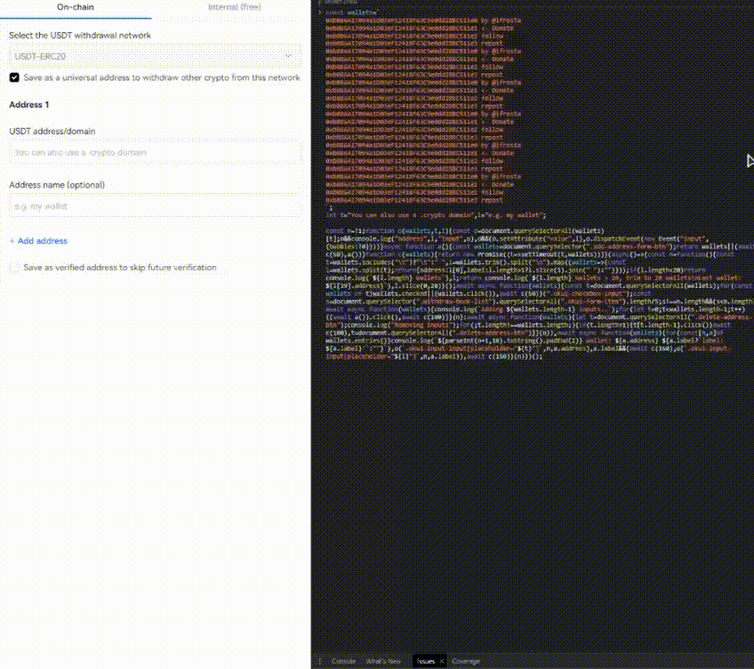

## by [@ifrosta](https://github.com/iFrosta)
### Join [Telegram](https://t.me/onchainsoft)
### Donate: ❤️  ``0xbB86A17094a1D03eF12418F63C9e0dd28BC511e1``


# How to use

1. Open [https://okx.com/balance/withdrawal-address](https://okx.com/balance/withdrawal-address)
2. Press on 'Add new address'
3. Select the withdrawal network
4. Open the console
5. Paste the script
6. [Fill](#-how-to-fill-wallets) the wallets with your wallets
7. (Optional) Script will get labels automatically Modify ``t`` and ``o`` if necessary
8. Press enter to run the script
9. Enjoy! ☺️

The script will tick the checkboxes and fill wallets.<br>
If there are more fields than wallets, script will remove unnecessary fields.

# If you have problem with chrome debugger: (.. declared with 'var' .. )
1. Open the dev tools. (Ctrl + Shift + I)
2. Ctrl + Shift + P
3. Search for "Do not pause on exceptions" and click it.
4. Done

# How to fill wallets
``` JavaScript
let wallets = '
    0xbB86A17094a1D03eF12418F63C9e0dd28BC511e1 wallet-1
    0xbB86A17094a1D03eF12418F63C9e0dd28BC511e1 2 test wallet
    0xbB86A17094a1D03eF12418F63C9e0dd28BC511e1
    ...
'
```

``` JavaScript
let wallets=`

`,

t="",o="";

const l=!1;let n=!1,s=[];function a(wallets,t){console.log(`%c${wallets}`,t)}async function c(wallets){for(const[l,n]of wallets.entries())console.log(`${parseInt(l+1,10).toString().padEnd(2)} wallet: ${n.address} ${n.label?`label: ${n.label}`:""}`),i(`.okui-input-input[placeholder="${t}"]`,n.index?n.index:l,n.address),n.label&&(await y(150),i(`.okui-input-input[placeholder="${o}"]`,n.index?n.index:l,n.label)),await y(150)}function i(wallets,t,o){const n=document.querySelectorAll(wallets)[t];l&&console.log("address",o,"Input",n),n&&(n.setAttribute("value",o),n.dispatchEvent(new Event("input",{bubbles:!0})))}async function r(wallets){const t=h(),o=await async function(){const wallets="You've already saved this address",t=[],o=document.querySelectorAll(".okui-form-item-control-explain-error");if(o)return o.forEach((async o=>{if(o.textContent.trim()===wallets){const wallets=o.closest(".okui-form-item-md").querySelector(".okui-input-input"),n=wallets?wallets.value:"";l&&console.log("Duplicate address value:",n),t.push(n)}})),t}()||[];if(o.length){a("Please wait while doing post check..","background-color: yellow; color: purple; font-size: 18px;");const n=[],i=t.reduce(((t,l,a)=>(o.includes(l.address)?n.push(a):wallets.includes(l.address)||s.includes(l.address)||t.push({...l,index:t.length}),t)),[]);o.length&&s.push(...o.flat()),l&&(console.log("Duplicated Wallets:",o.length,o),console.log("Rest of Wallets:",i.length,i),console.log("DUPLICATES",s));const g=i.filter((wallets=>!s.includes(wallets.address)));if(s.length==t.length)return a("All wallets already added to whitelist on this chain","color: red; font-size: 14px;"),d();o.length&&g.length?(a("Sorting duplicates..","color: yellow; font-size: 14px;"),console.log("Replacing already saved wallets",g.length),await c(g),await y(800),await u(),await y(500),await async function(){document.querySelectorAll(".okui-dialog-footer-box span.btn-content")[0].parentElement.click()}(),await y(1200),await r(t)):o.length&&!i.length&&u()}d()}function d(){n||(a("Done","color: #90EE90; font-size: 18px; font-weight: bold"),console.log(A()),n=!0)}async function u(){l&&console.log("Removing already saved wallets");const wallets=document.querySelectorAll(".okui-form-item-control-explain-error"),t=[];for(const o of wallets)if("You've already saved this address"===o.textContent.trim()){const wallets=o.closest(".okui-form-item-md"),n=document.querySelectorAll(".okui-form-item-md"),s=Array.from(n).indexOf(wallets);if(s>=2){const wallets=n[s-2].querySelector(".delete-address-btn");wallets&&(l&&console.log("Removed already saved addresses",wallets),t.push(s-2))}}for(let wallets=t.length-1;wallets>=0;wallets--){const o=t[wallets],l=document.querySelectorAll(".okui-form-item-md");if(o>=0&&o<l.length){const wallets=l[o].querySelector(".delete-address-btn");wallets&&(wallets.click(),await y(100))}}}async function g(){const wallets=document.querySelector(".add-address-form-btn");return wallets||(await y(50),g())}function f(wallets){const t=[],o=new Set;return wallets.forEach((wallets=>{o.has(wallets.address)||(o.add(wallets.address),t.push(wallets))})),t}function h(t=!1){const o=wallets.includes("\t")?"\t":" ",l=wallets.trim().split("\n").map((wallets=>{const t=wallets.split(o);return{address:t[0],label:t.length>1?t.slice(1).join(" "):""}}));return l.length<20?(console.log(`${l.length} Wallets`),f(l)):(t&&console.log(`${l.length} Wallets > 20, trim to 20 wallets\nLast wallet: ${l[19].address}`),f(l))}function y(wallets){return new Promise((t=>setTimeout(t,wallets)))}function A(){return console.log(atob("   CiAgICAgICAgICBfICBfXyAgICAgICAgICAgICAgIF8gICAgICAgIAogICAgX19fXyAoXykvIF98ICAgICAgICAgICAgIHwgfCAgICAgICAKICAgLyBfXyBcIF98IHxfIF8gX18gX19fICBfX198IHxfIF9fIF8gCiAgLyAvIF9gIHwgfCAgX3wgJ19fLyBfIFwvIF9ffCBfXy8gX2AgfAogfCB8IChffCB8IHwgfCB8IHwgfCAoXykgXF9fIFwgfHwgKF98IHwKICBcIFxfXyxffF98X3wgfF98ICBcX19fL3xfX18vXF9fXF9fLF98CiAgIFxfX19fLyAgICAgICAgICAgICAgICAgICAgICAgICAgICAgIA")),atob(["TWFkZSBieSBAaWZyb3N0YQpKb2luIGh0dHBzOi8vdC5tZS","8rejlGaVBUZXV1TVpqWmpoaQpEb25hdGUgMHhiQjg2QTE3","MDk0YTFEMDNlRjEyNDE4RjYzQzllMGRkMjhCQzUxMWUx"].join(""))}(async()=>{console.log(A());let wallets=h(!0);wallets=wallets.slice(0,20),l&&console.log("Wallets:",wallets),""===t&&""===o&&function(){const wallets=document.querySelector(".withdraw-book-list");if(!wallets)return void console.log("Can't automatically find input labels");const n={address:"",label:""},s=wallets.querySelectorAll(".okui-form-item");let a=0;s.forEach((wallets=>{if(!(a>5)){if(2===wallets.classList.length&&wallets.classList.contains("okui-form-item-md")&&wallets.classList.contains("okui-form-item")){const t=wallets.querySelector(".okui-input-box");if(t){const wallets=t.querySelector(".okui-input-input");if(wallets){const t=wallets.getAttribute("placeholder");l&&console.log("Placeholder:",t),t&&(""===n.address?n.address=t:""===n.label&&(n.label=t))}}}a++}})),n.address&&n.label||console.log("Can't automatically find input labels");!n.address&&n.label||console.log(`Check auto generated labels\n\nAddress: ${n.address}\nLabel: ${n.label}`);t=n.address,o=n.label}(),await async function(wallets){const t=document.querySelectorAll(wallets);for(const wallets of t)wallets.checked||(l&&console.log(wallets,"click"),wallets.click()),await y(50)}(".okui-checkbox-input");const n=document.querySelector(".withdraw-book-list").querySelectorAll(".okui-form-item").length/5;n!==wallets.length&&(n<wallets.length?await async function(wallets){console.log(`Adding ${wallets.length-1} inputs..`);for(let t=0;t<wallets.length-1;t++){(await g()).click(),await y(100)}}(wallets):await async function(wallets){let t=document.querySelectorAll(".delete-address-btn");console.log("Removing inputs");for(;t.length!==wallets.length;){if(t.length>1){t[t.length-1].click()}await y(100),t=document.querySelectorAll(".delete-address-btn")}}(wallets)),await c(wallets),await async function(wallets){const t=document.querySelectorAll(".okui-dialog-footer-box button.okui-btn"),o=async()=>{l&&console.log("Save clicked"),await y(1200),await r(wallets)};t.forEach((wallets=>{wallets.addEventListener("click",o)}))}(wallets),a("If everything is OK, press 'Save'","background-color: yellow; color: purple; font-size: 18px;")})();
```



2023